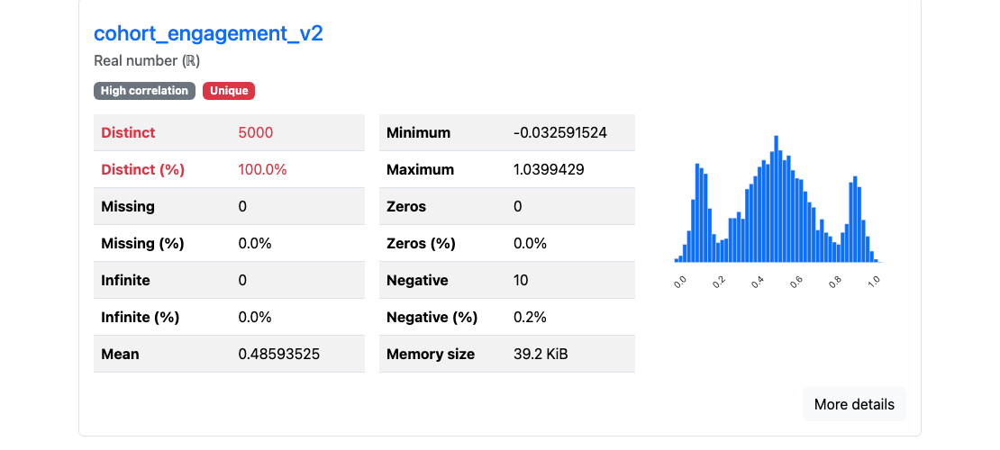

# biopsy

`biopsy` is a Python library and CLI for the first EDA pass before you train a
model. Point it at a CSV, Parquet file, dataframe, or warehouse table and it
returns a short ranked report: the columns worth checking first, the likely
modeling problems (leakage, drift, nulls, IDs), the target signal per feature,
and a preprocessing plan it can emit as runnable sklearn code.

It is opinionated on purpose: a descriptive profiler shows you everything about
every column; biopsy ranks the dozen things that matter for the model and says
what to do about them.

## Why not ydata-profiling?

Different job. `ydata-profiling`, SweetViz, and DataPrep write an exhaustive
*description* of a dataset — dozens of sections of histograms, quantiles, and
correlations for every column. `biopsy` *ranks* the handful of things that will
break your model and says what to do about each. Leakage is the clearest case.

`biopsy demo --rows 5000` builds a synthetic churn dataset with one planted
**temporal leak**: `cohort_engagement_v2` is backfilled from the outcome, but
only for the most recent ~30% of users. It looks like a perfectly healthy
feature — no nulls, a clean distribution, every value present.

ydata-profiling renders it as 1 of 15 variable cards and tags it **High
correlation** with the target. But that badge is one of 14 unranked alerts — the
same one it puts on the benign `n_logins ↔ tenure_months` pair — and "correlated
with the target" is what every *good* feature looks like. ydata never splits on
time, so it can't tell this leak from signal:



`biopsy` ranks the same column as a **CRITICAL** leak, at the top of the report,
and shows the mechanism:

```text
───────────────────────────── Findings ─────────────────────────────
 ■  `days_since_last_login` may leak the target (score=1.00)
 ■  `cohort_engagement_v2` may leak future information
    Predicts target on random CV (0.39) but fails on time-ordered
    split (0.00). Likely contains future information.
 ▲  `status` is constant
 ▲  `constant_col` is constant
 ▲  `user_id` looks like an identifier
        … 10 more findings, ranked by severity

──────────────────────── Temporal → signup_date ────────────────────
 feature                random→time   drift   monotonicity
 cohort_engagement_v2   0.39 → 0.00    0.53           0.07
```

The tell is the **collapse**: 0.39 predictive power (PPS) under random
cross-validation, **0.00** under a time-ordered split. Validate the usual way
and this column looks like one of your best features in testing, then
contributes nothing in production. A describe-everything profiler can't surface
that — a ranked report with a time-ordered check is the whole point of `biopsy`.

<details>
<summary>Reproduce both numbers (the demo seed is pinned)</summary>

```bash
# write the identical demo dataset — biopsy's seed is fixed at 42
python -c "from biopsy.demo import write_demo_csv; write_demo_csv('/tmp/demo.csv', n=5000)"

# biopsy's view — the CRITICAL leak block above
biopsy profile /tmp/demo.csv --target churned

# ydata-profiling's view — a throwaway venv, never added to biopsy's deps
uv venv /tmp/ydata
uv pip install --python /tmp/ydata/bin/python ydata-profiling pandas "setuptools<81"
/tmp/ydata/bin/python -c "import pandas as pd; from ydata_profiling import ProfileReport; ProfileReport(pd.read_csv('/tmp/demo.csv')).to_file('/tmp/ydata.html')"
```

</details>

```bash
biopsy profile data.parquet --target label
biopsy profile data.parquet --target label --html report.html --pipeline preprocess.py
biopsy compare train.parquet eval.parquet --target label
biopsy doctor data.parquet
```

```python
from biopsy import profile

prof = profile("training.parquet", target="label", time_col="event_time")

prof.top_findings()
prof.feature_shortlist(limit=20)
prof.action_plan()
prof.to_sklearn_pipeline_code()
```

## What it reports

- Ranked findings: leakage, drift, nulls, outliers, IDs, suspicious date strings,
  near-constant columns, and other modeling risks.
- Target signal: PPS, mutual information, Spearman, AUC, and optional permutation
  importance in `--deep` mode.
- A feature shortlist: one representative from each correlated group, ranked by
  target signal.
- A preprocessing plan: drop, impute, encode, transform, split, CV, and class
  imbalance recommendations.
- Drift reports with schema changes, target movement, and per-column distribution
  changes.
- Optional HTML reports and saved JSON artifacts.

## Install

Requires Python 3.11+. It is not on PyPI yet, so install from source:

```bash
git clone <repo>
cd biopsy
uv venv && source .venv/bin/activate
uv pip install -e .
```

Optional extras:

```bash
uv pip install -e ".[dataframe]"   # pandas, polars, pyarrow
uv pip install -e ".[warehouse]"   # BigQuery, Snowflake, Postgres, object stores
uv pip install -e ".[dev]"         # tests and linting
```

## Python API

Profile a file:

```python
from biopsy import profile

prof = profile(
    "training.parquet",
    target="label",
    time_col="event_time",
    exclude=["row_id"],
    where=["split in train,validation"],
    sample=50_000,
)
```

Profile a dataframe:

```python
import pandas as pd
from biopsy import profile

df = pd.read_parquet("training.parquet")
prof = profile(df, target="label", source_name="training")
```

Common outputs:

```python
prof.findings_records()
prof.target_signal_records()
prof.shortlist_records()
prof.action_plan_records()
prof.save("profile.json")

prof.findings_frame()       # when pandas is installed
prof.columns_frame()
prof.target_signal_frame()
prof.shortlist_frame()

profile(df, target="label").show()  # notebook HTML
```

Modeling helpers:

```python
plan = prof.action_plan()
plan.drop
plan.impute
plan.encode
plan.transform
plan.split
plan.cv
plan.class_strategy

code = prof.to_sklearn_pipeline_code()
```

Compare two profiles:

```python
from biopsy import compare_profiles

report = compare_profiles(prof_train, prof_eval)
report.schema.added
report.schema.removed
report.target
report.top(10)
```

Diff two profiles:

```python
old = profile("old.parquet", target="label")
new = profile("new.parquet", target="label")

diff = new.diff(old)
diff.appeared
diff.resolved
diff.severity_changed
diff.rank_changed
```

Supported inputs:

- CSV, TSV, Parquet, and JSON paths
- pandas, Polars, Arrow, and DuckDB relation objects
- `s3://`, `gs://`, `https://`, `postgres://`, `bigquery://`, and `snowflake://`
  URIs

Pandas, Polars, Arrow, and warehouse drivers are optional dependencies.

## CLI

```bash
biopsy profile <file-or-uri> [options]
biopsy compare <A> <B> [options]
biopsy diff <a.json> <b.json>
biopsy doctor <file-or-uri>
biopsy init <file>
biopsy notebook <out.ipynb> --file <data> --target <col>
biopsy render <profile.json> --html <out.html>
biopsy demo --rows 5000
```

Useful `profile` options:

| Flag | Meaning |
|---|---|
| `--target, -t COL` | Target column for predictive metrics |
| `--time COL` | Time column for temporal checks; auto-detected when possible |
| `--exclude, -x COL` | Omit a column from analysis; repeatable |
| `--exclude-file PATH` | Omit columns listed one per line |
| `--filter, -w EXPR` | Filter rows before profiling; repeatable |
| `--sample N` | Sample N rows before profiling |
| `--target-sample N` | Sample size for target metrics; default `30000` |
| `--fast / --deep` | `--deep` adds pairwise MI and permutation importance |
| `--max-cols N` | Cap columns in the pairwise MI pass |
| `--shortlist N` | Limit the feature shortlist |
| `--html PATH` | Write an HTML report |
| `--save PATH` | Save profile JSON |
| `--pipeline PATH` | Write sklearn preprocessor code |
| `--config PATH` | Load defaults from TOML |
| `--open` | Open the HTML report |

Filter examples:

```bash
--filter 'segment in train,test'
--filter 'value > 0'
--filter 'event_time is not null'
--filter 'label == positive'
```

Config files remove repeated flags:

```toml
target = "target"
time = "snapshot_date"
filter = ["segment in A,B,C"]
exclude = ["account_key", "segment"]
fast = true

[profiles.deep]
fast = false
plotly_cdn = true
```

```bash
biopsy profile data.parquet --config biopsy.toml
biopsy profile data.parquet --config biopsy.toml --profile-name deep --html report.html
```

Generate a starter config:

```bash
biopsy init data.parquet
```

## Warehouse Sources

Pass a URI anywhere a file path is accepted:

```bash
biopsy profile s3://my-bucket/events.parquet --target conversion
biopsy profile postgres://localhost/sales?table=public.orders --target shipped
biopsy profile bigquery://my-project/analytics.events --target conversion --sample 50000
biopsy profile snowflake://my-acct/SALES.PUBLIC.ORDERS --target shipped --sample 50000
biopsy compare \
  postgres://localhost/sales?table=public.train \
  postgres://localhost/sales?table=public.eval \
  --target shipped
biopsy doctor snowflake://my-acct/SALES.PUBLIC.ORDERS
```

Warehouse reads are pull-only. `doctor` uses schema discovery and does not pull
row data. For `profile`, filters and limits are pushed down for BigQuery and
Snowflake; object-store and Postgres reads go through DuckDB. `--sample N`
becomes `LIMIT N` for warehouse sources, so use `--filter` when the first N rows
would be biased.

Credentials come from environment variables and are not stored in profiles or
printed in progress output.

| Scheme | Env vars |
|---|---|
| `s3://`, `s3a://` | Optional `AWS_ACCESS_KEY_ID`, `AWS_SECRET_ACCESS_KEY`, `AWS_SESSION_TOKEN`, `AWS_REGION`, `AWS_DEFAULT_REGION` |
| `gs://`, `gcs://` | Optional `GOOGLE_APPLICATION_CREDENTIALS` |
| `https://`, `http://` | Optional `BIOPSY_HTTPS_BEARER` |
| `postgres://`, `postgresql://` | Optional libpq vars: `PGHOST`, `PGUSER`, `PGPASSWORD`, `PGDATABASE`, `PGPORT`, `PGSSLMODE` |
| `bigquery://` | Required `GOOGLE_APPLICATION_CREDENTIALS`; optional `BIGQUERY_PROJECT` |
| `snowflake://` | Required `SNOWFLAKE_ACCOUNT`, `SNOWFLAKE_USER`, and either `SNOWFLAKE_PRIVATE_KEY_PATH` or `SNOWFLAKE_PASSWORD`; optional `SNOWFLAKE_WAREHOUSE`, `SNOWFLAKE_ROLE`, `SNOWFLAKE_DATABASE`, `SNOWFLAKE_SCHEMA` |

Use a prefix for another credential set:

```bash
biopsy profile s3://staging-bucket/events.parquet --credentials-env STAGING
biopsy compare \
  postgres://prod/sales?table=public.train \
  postgres://prod/sales?table=public.eval \
  --credentials-env STAGING
# reads STAGING_AWS_ACCESS_KEY_ID, STAGING_AWS_SECRET_ACCESS_KEY, ...
```

Install only the backends you need:

```bash
uv pip install -e ".[object-store]"
uv pip install -e ".[postgres]"
uv pip install -e ".[bigquery]"
uv pip install -e ".[snowflake]"
uv pip install -e ".[warehouse]"
```

## Development

```bash
uv run pytest tests/ -q
uv run ruff check src tests
uv run biopsy demo --rows 1000
```

## License

MIT
